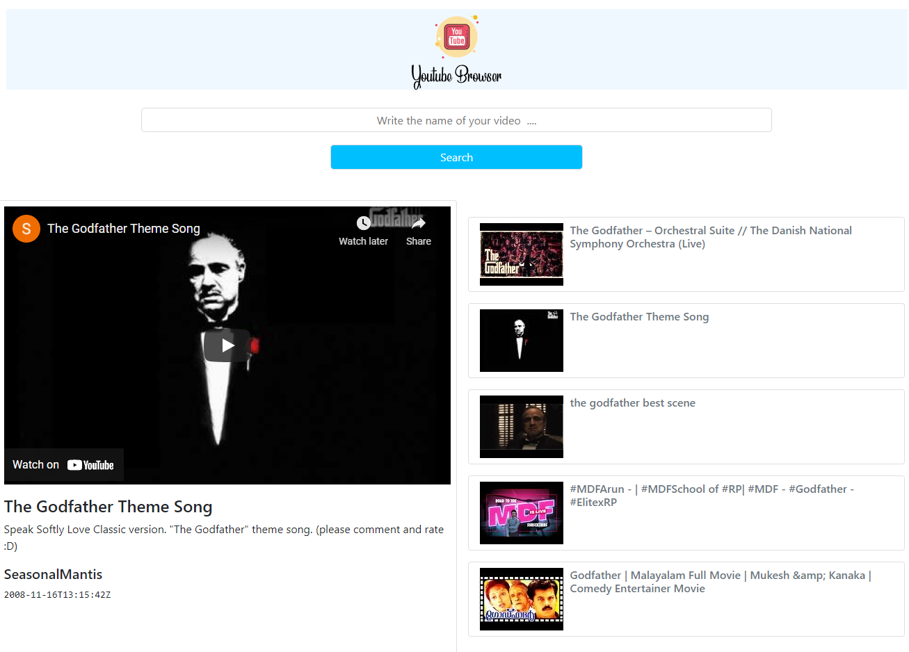

<h1>Youtube-Browse</h1>

This is a project that is made with vue.js. The aim of this project was to use youtube data api to fetch limited youtube videos and display it in simple UI. This is a light application that is great for speed search of a specific topic on youtube. In this project, vue concepts of prop drilling, emitting events, component and data structure were used to build this application.

</h1>Additional description about the project and its features.</h1>

<h2>Built With</h2>

- Vue Js
- Youtube data api
- Bootstrap
- Axios

<h2>Live Demo</h2>
https://youtube-browse-light.netlify.app/

<h2>Getting Started</h2>
To get a local copy up and running follow these simple example steps.

Clone the repository and get the files in your local branch. Use it according
to your convenience.

Prerequisites
Text editor,Github profile and Git.

<h2>Authors</h2>

👤 Author1

Github:
@ajkacca457

Twitter:
@ajkacca

Linkedin:
https://www.linkedin.com/in/avijit-karmaker-8738a54a/

🤝 <h2>Contribution</h2>
Contributions, issues and feature requests are welcome!

Feel free to check the issues page.

Show your support
Give a ⭐️ if you like this project!

Acknowledgement
Project is inspired from Florin Pop youtube channel.

📝 <h2>License</h2>
This project is a personal project of Avijit.
